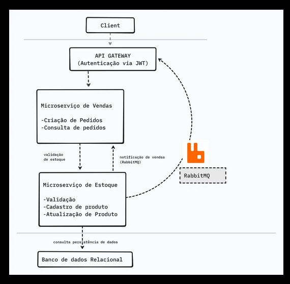

## E-commerce Microservices

Plataforma de e-commerce construída com arquitetura de microserviços para gestão de produtos/estoque e vendas. O objetivo é oferecer uma base modular, escalável e segura, com comunicação síncrona via API Gateway e assíncrona via mensageria.

---

### Sumário
- **Visão Geral**
- **Arquitetura**
- **Serviços**
- **Tecnologias**
- **Principais fluxos**
- **Testes, Logs e Observabilidade**
- **Roadmap**
- **Contribuição**

---

### Visão Geral
Este projeto contém dois microserviços principais e um API Gateway:
- **Gestão de Estoque**: cadastro de produtos, consulta de catálogo e controle de quantidades.
- **Gestão de Vendas**: criação e acompanhamento de pedidos, validação de estoque e baixa após confirmação.
- **API Gateway**: ponto único de entrada e roteamento para os serviços.

Comunicação assíncrona é feita via **RabbitMQ** para desacoplamento entre eventos de venda e atualização de estoque. A segurança é garantida via **JWT**.

---

### Arquitetura

- **API Gateway**: roteia chamadas e centraliza autenticação/limites.
- **Estoque Service**: mantém produtos e níveis de estoque.
- **Vendas Service**: processa pedidos e publica eventos de venda.
- **RabbitMQ**: entrega eventos de forma confiável entre serviços.
- **Banco de Dados**: cada serviço possui seu próprio schema/DB.
- **Auth (JWT)**: protege endpoints sensíveis.

---

### Serviços
- **Estoque (Inventory Service)**
  - Endpoints: CRUD de produtos, consulta de estoque.
  - Consome eventos de venda para reduzir quantidades.

- **Vendas (Orders/Sales Service)**
  - Endpoints: criação e consulta de pedidos.
  - Publica eventos no RabbitMQ após confirmação.

- **API Gateway**
  - Roteamento, rate limit (futuro) e autenticação.

---

### Tecnologias
- **.NET** para APIs
- **Entity Framework Core** para persistência relacional (SQL Server ou compatível)
- **RabbitMQ** para mensageria
- **JWT** para autenticação e autorização
- **REST** para contratos HTTP

---

### Principais fluxos

O sistema deve permitir o cadastro de produtos no microserviço de estoque. 

O sistema deve permitir a criação de pedidos no microserviço de vendas, com validação de estoque antes de confirmar o pedido. 

A comunicação entre os microserviços deve ser feita de forma eficiente usando RabbitMQ para notificações de vendas e atualizações de estoque. 

 O sistema deve ter uma API Gateway que direcione as requisições para os microserviços corretos. 

O sistema deve ser seguro, com autenticação via JWT para usuários e permissões específicas para cada ação. 

O código deve ser bem estruturado, com separação de responsabilidades e boas práticas de POO. 

---

### Testes, Logs e Observabilidade
- **Testes Unitários**: foco em regras de negócio de produtos e pedidos.
- **Logs**: estruturados (JSON) e com correlação entre serviços via IDs de correlação.
- **Health Checks**: endpoints de saúde por serviço (`/health`).

---

### Roadmap
- Implementar serviços de Estoque e Vendas
- Integrar API Gateway
- Publicar/consumir eventos no RabbitMQ
- Autenticação/Autorização com JWT
- Docker Compose para ambiente local
- Observabilidade (Tracing e Métricas)

